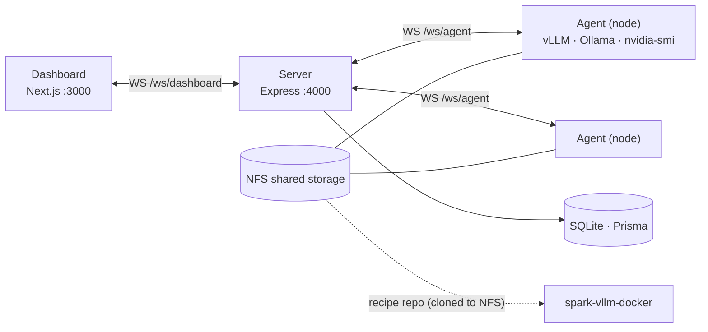
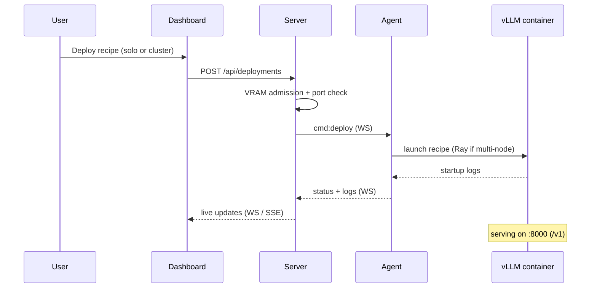
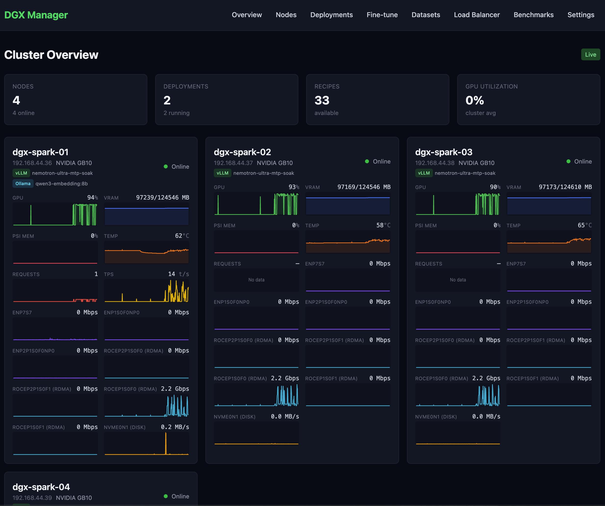
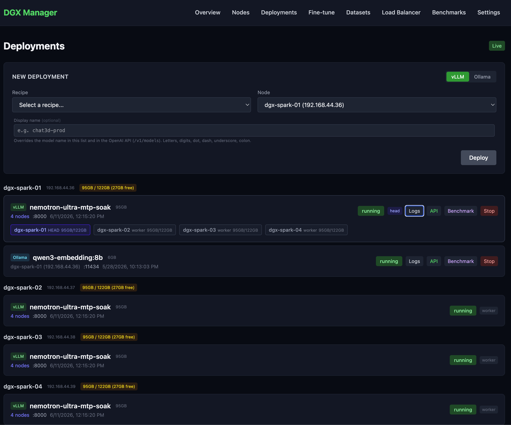
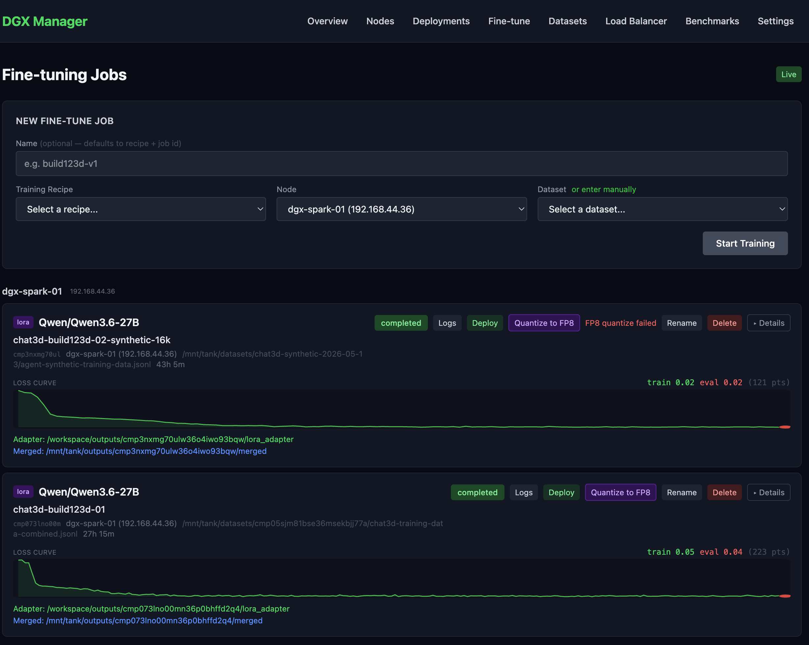
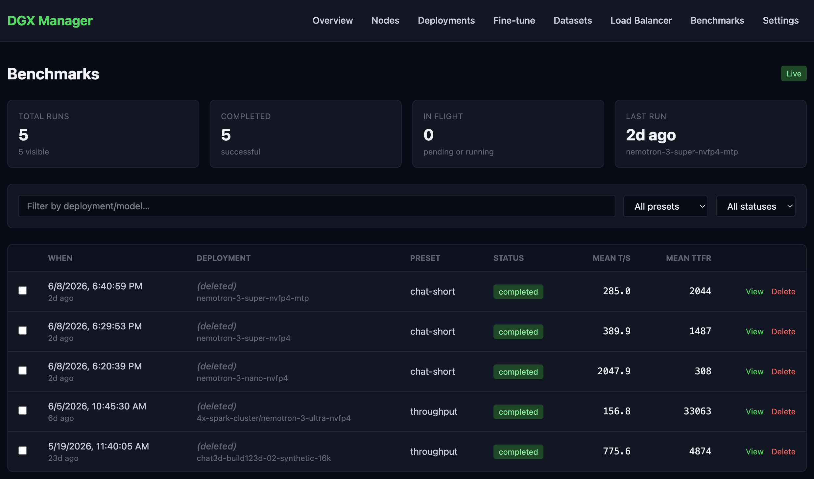

# DGX Manager

A self-hosted control plane for a DGX Spark GPU cluster: provision nodes over
SSH or a join token, deploy and load-balance inference, fine-tune models, and
benchmark them — with a real-time web dashboard and zero cloud dependencies.

> **Running it yourself?** See the **[Self-Hosting Guide](docs/SELF-HOSTING.md)**.

## What it does

- **Real-time GPU telemetry** — utilization, VRAM, temperature, network/RDMA across every node at 5-second resolution
- **One-click model deployment** — vLLM (container, YAML-recipe-driven) and Ollama (native)
- **Multi-node inference clusters** — tensor/pipeline parallelism over Ray; serves models up to **Nemotron-3-Ultra 550B-A55B NVFP4 across 4 nodes**
- **Load balancer** — rules + endpoints API, plus a round-robin / first-available inference proxy *(proxy and dashboard UI not yet wired up)*
- **End-to-end fine-tuning** — LoRA via DeepSpeed ZeRO-2/3, TRL+PEFT, or Unsloth; multi-node training; resume-from-checkpoint; merge → deploy in one loop
- **Live training observability** — phase-aware progress and a live loss curve (train + eval overlay) streamed to the dashboard
- **Benchmarking & evaluation** — llama-benchy presets (`quick-smoke`, `chat-short`, `chat-long`, `code-32k`, `throughput`) with a compare view
- **Zero-touch onboarding** — single-use join tokens + a self-contained install script; HTTP agent auto-update
- **Heterogeneous hardware** — arm64 (DGX Spark / GB10) and amd64 nodes, per-arch agent bundles

## Architecture

A three-package TypeScript monorepo. The dashboard talks to the server over
WebSocket; the server talks to an agent on each node; agents run the runtimes
and report metrics.

A deployment flows from the dashboard to a node and streams back live:

## Screenshots

> Images live in [`docs/screenshots/`](docs/screenshots/) — see [`missing-screenshots.md`](missing-screenshots.md).

| Cluster overview | Multi-node deployment |
|---|---|
|  |  |

| Live training loss curve | Benchmarks |
|---|---|
|  |  |

## Feature tour

### Nodes & metrics

Each DGX node registers via SSH provisioning or a single-use join token. Once
connected, the agent streams GPU utilization, VRAM usage, temperature, and
RDMA network counters every 5 seconds. The overview page aggregates the live
feed across every node in the cluster. See the [Self-Hosting Guide](docs/SELF-HOSTING.md)
for provisioning details.

### Deployments

Models are deployed from YAML recipes (discovered from
[spark-vllm-docker](https://github.com/kreuzhofer/spark-vllm-docker)) or via
Ollama. Single-node and multi-node Ray clusters are both supported, with VRAM
admission control that blocks deploys that would over-subscribe available memory.
Deployment logs stream live to the dashboard over SSE. Note: `status: "running"`
means the container started — actual vLLM readiness depends on model load time
and is signalled separately once the `/v1` endpoint becomes responsive.

### Fine-tuning

Submit LoRA fine-tune jobs directly from the dashboard: pick a training recipe,
a dataset, and hyperparameters. Training runs via DeepSpeed ZeRO-2/3, TRL+PEFT,
or Unsloth across one or multiple nodes, with live loss-curve streaming. Finished
adapters can be merged and promoted to a deployment in one click. See
[Gemma 4 fine-tuning on DGX Spark](docs/gemma4-fine-tuning-on-dgx-spark.md) for
a detailed walk-through of a real training run.

### Benchmarks & evaluation

Run llama-benchy presets (`quick-smoke`, `chat-short`, `chat-long`, `code-32k`,
`throughput`) against any live deployment. Results are stored and a compare view
lets you track regressions across model versions. See the
[Qwen 3.6 inference benchmark write-up](docs/qwen3.6-inference-benchmark.md) for
an example of real numbers from the cluster.

### Load balancer

Rules and endpoints are managed via the `/api/lb` REST API. A round-robin /
first-available inference proxy is implemented in `proxy/inference-proxy.ts`
but is not currently mounted in the server. **The dashboard UI is also pending.**

### Agent onboarding & updates

Nodes are onboarded with a single token-scoped install script that downloads the
right architecture bundle (arm64 or amd64), installs the agent as a systemd
service, and connects it back to the manager. When a new agent version ships, the
dashboard shows an upgrade prompt and the manager serves the updated bundle over
HTTP — no manual SSH needed. Full details in the
[Self-Hosting Guide](docs/SELF-HOSTING.md).

For full feature status see [docs/ROADMAP.md](docs/ROADMAP.md).

## Tech stack

TypeScript monorepo (npm workspaces) · Express 5 + `ws` · Next.js 15 / React 19 /
Tailwind 4 · Prisma 7 + SQLite · Docker / Docker Compose · Ray · DeepSpeed / PEFT /
TRL / Unsloth · vLLM · Ollama · llama-benchy

## Repository layout

- `packages/server` — Express REST API + WebSocket hubs (:4000)
- `packages/dashboard` — Next.js web UI (:3000)
- `packages/agent` — node agent: metrics, deployments, training
- `docs/` — guides, deep-dive write-ups, ROADMAP, specs/plans

**Related repositories:**
[spark-vllm-docker](https://github.com/kreuzhofer/spark-vllm-docker) ·
[dgx-manager-fine-tune-recipes](https://github.com/kreuzhofer/dgx-manager-fine-tune-recipes)

## API

REST under `/api`, plus WebSocket hubs at `/ws/dashboard` and `/ws/agent`.

| Route group | Purpose |
|-------------|---------|
| `/api/nodes` | Node lifecycle, provisioning, agent updates |
| `/api/models` | Model registry |
| `/api/deployments` | Solo & cluster deployments, logs, restart |
| `/api/finetune` | Fine-tune jobs, resume, merge, deploy |
| `/api/lb` | Load-balancer rules & endpoints |
| `/api/recipes` | vLLM recipes (discovered from agents) |
| `/api/training-recipes` | Training recipes + inference variants |
| `/api/tokens` | Single-use agent join tokens |
| `/api/settings` | Server settings |
| `/api/ollama-catalog` | Ollama model catalog |
| `/api/agent` | Agent bundle + install script |
| `/api/datasets` | Dataset upload/registration/preview |
| `/api/benchmarks` | llama-benchy benchmark runs |
| `/api/events` | Server-Sent Events stream for real-time dashboard updates |
| `/api/health` | Health check |

Full setup and endpoint detail: **[Self-Hosting Guide](docs/SELF-HOSTING.md)**.

## Project status

Nodes & metrics, deployments (solo and multi-node), fine-tuning, datasets, and
benchmarks are functional end-to-end. The Models and Load Balancer pages have
complete server APIs with dashboard UIs still pending. Auth and multi-cluster
support are future phases. See [docs/ROADMAP.md](docs/ROADMAP.md) for the full
feature status.
