# DGX Manager

A self-hosted control plane for a DGX Spark GPU cluster: provision nodes over
SSH or a join token, deploy and serve inference behind one OpenAI-compatible
URL, fine-tune models, and benchmark them — with a real-time web dashboard and
zero cloud dependencies.

> **Running it yourself?** See the **[Self-Hosting Guide](docs/SELF-HOSTING.md)**.
> For the domain vocabulary this codebase is written in, see **[CONTEXT.md](CONTEXT.md)**.

## What it does

- **Real-time GPU telemetry** — utilization, VRAM, temperature, network/RDMA across every node at 5-second resolution
- **One-click model deployment** — two inference runners ([sparkrun](https://github.com/spark-arena/sparkrun) for registry recipes, **dgxrun** for recipes versioned in this repo) plus Ollama (native)
- **Reproducible recipes** — 12 measured recipes under [`recipes/dgxrun/`](recipes/dgxrun), each pinned to a container image and a set of **mods**, so a deploy reproduces on a node that has never been touched
- **Multi-node inference clusters** — tensor/pipeline parallelism over Ray; serves Nemotron-3-Ultra 550B-A55B NVFP4 across 4 nodes, and GLM-5.2 at a **320K context** window across 4 nodes
- **Inference gateway** — one OpenAI-compatible URL fronting every running deployment, routed by the model name in the request; chat completions and embeddings are served today, balanced across a pool by least-outstanding ([ADR 0001](docs/adr/0001-inference-gateway.md))
- **Node power control** — reboot, shutdown, or sleep a node from the dashboard, and wake it again with a Wake-on-LAN packet
- **End-to-end fine-tuning** — LoRA via DeepSpeed ZeRO-2/3, TRL+PEFT, or Unsloth; multi-node training; resume-from-checkpoint; merge → deploy in one loop
- **Live training observability** — phase-aware progress and a live loss curve (train + eval overlay) streamed to the dashboard
- **Benchmarking & evaluation** — throughput, tool-calling, and lm-eval accuracy suites (GPQA-Diamond, MMLU-Pro, IFEval, GSM8K, BBH, MATH-hard), executed on a dedicated eval node with a compare view
- **Weight-cache management** — see what every node has in its HuggingFace cache, scan it, and reclaim disk
- **Zero-touch onboarding** — single-use join tokens + a self-contained install script; HTTP agent auto-update
- **Heterogeneous hardware** — arm64 (DGX Spark / GB10) and amd64 nodes, per-arch agent bundles; recipes can target an amd64 host with no RoCE fabric (there is a measured RTX 5090 recipe)

## Architecture

A three-package TypeScript monorepo. The dashboard talks to the server over
WebSocket; the server talks to an agent on each node; agents drive the inference
runners and report metrics. Inference clients never talk to a node — they talk
to the gateway on the manager.

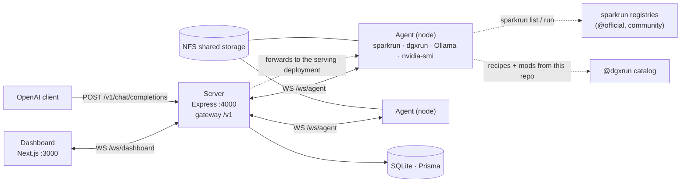
```mermaid
flowchart LR
    D["Dashboard<br/>Next.js :3000"] <-->|"WS /ws/dashboard"| S["Server<br/>Express :4000<br/>gateway /v1"]
    C["OpenAI client"] -->|"POST /v1/chat/completions"| S
    S <-->|"WS /ws/agent"| A1["Agent (node)<br/>sparkrun · dgxrun · Ollama · nvidia-smi"]
    S <-->|"WS /ws/agent"| A2["Agent (node)"]
    S --> DB[("SQLite · Prisma")]
    S -.->|"forwards to the serving deployment"| A1
    NFS[("NFS shared storage")] --- A1
    NFS --- A2
    A1 -.->|"sparkrun list / run"| REG["sparkrun registries<br/>(@official, community)"]
    A1 -.->|"recipes + mods from this repo"| DGX["@dgxrun catalog"]
```

A deployment flows from the dashboard to a node and streams back live. The head
node runs the recipe's runner, which distributes the container image + model and
starts the runtime (Ray or a multi-process launch for multi-node):

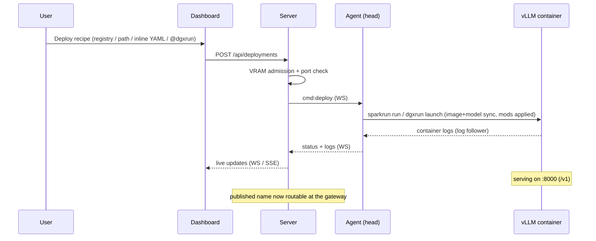
```mermaid
sequenceDiagram
    participant U as User
    participant D as Dashboard
    participant S as Server
    participant A as Agent (head)
    participant C as vLLM container
    U->>D: Deploy recipe (registry / path / inline YAML / @dgxrun)
    D->>S: POST /api/deployments
    S->>S: VRAM admission + port check
    S->>A: cmd:deploy (WS)
    A->>C: sparkrun run / dgxrun launch (image+model sync, mods applied)
    C-->>A: container logs (log follower)
    A-->>S: status + logs (WS)
    S-->>D: live updates (WS / SSE)
    Note over C: serving on :8000 (/v1)
    Note over S: published name now routable at the gateway
```

## Screenshots

| Cluster overview — live GPU / VRAM / RDMA per node | Multi-node cluster deployment + per-node controls |
|---|---|
| 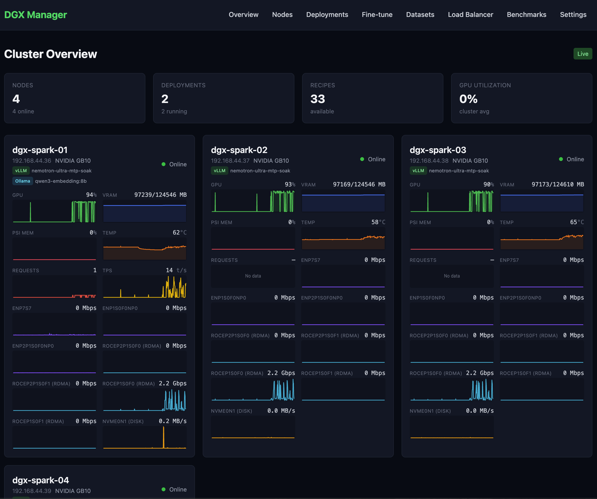 | 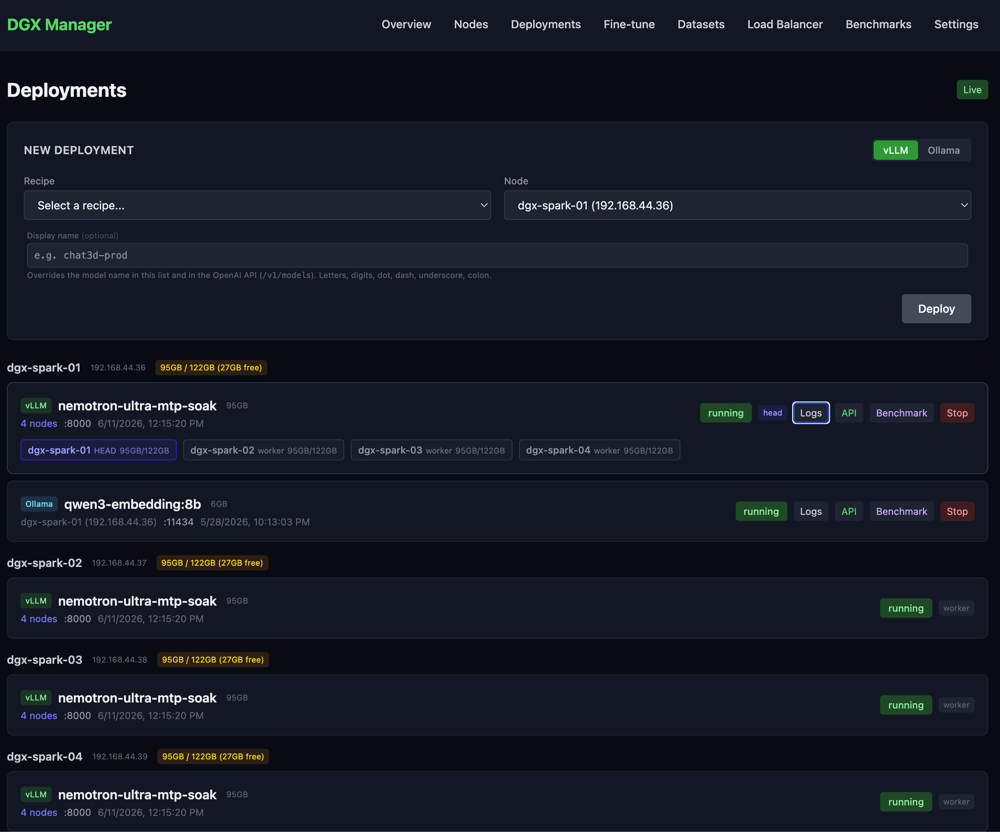 |

| Live fine-tuning loss curve (train + eval) | Per-run benchmark throughput & latency |
|---|---|
| 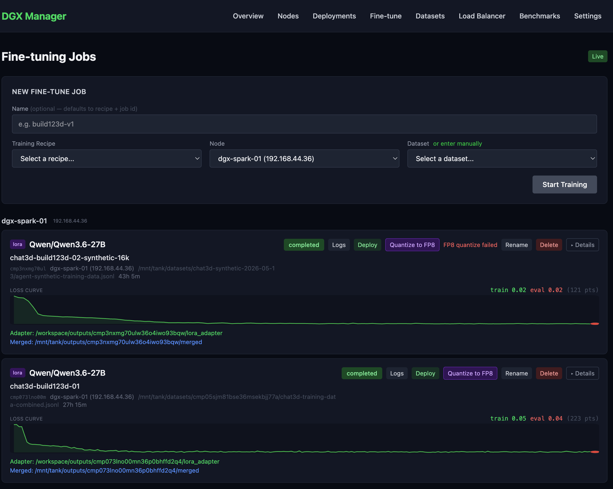 | 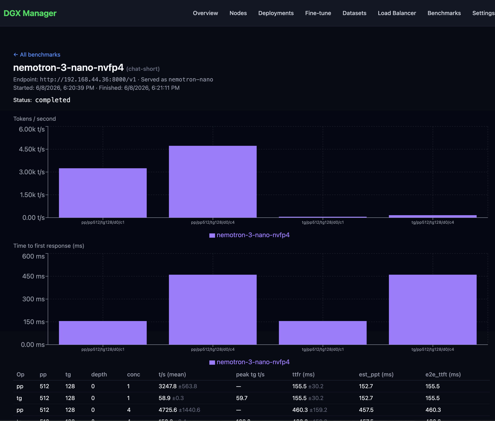 |

## Feature tour

### Nodes, metrics & power

Each DGX node registers via SSH provisioning or a single-use join token. Once
connected, the agent streams GPU utilization, VRAM usage, temperature, and RDMA
network counters every 5 seconds. The overview page aggregates the live feed
across every node in the cluster.

Nodes can also be powered from the dashboard: `reboot`, `shutdown`, and `sleep`
go over the agent's existing WebSocket when it is connected, and fall back to
SSH when it is not — so a wedged node is still reachable. Either path captures
the node's MAC and arms Wake-on-LAN on the way down, which is what makes
`POST /api/nodes/:id/wake` able to bring it back. See the
[Self-Hosting Guide](docs/SELF-HOSTING.md) for provisioning details.

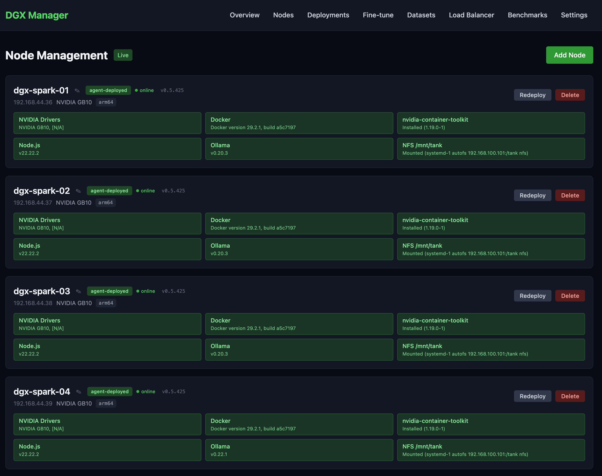

### Deployments

Two inference runners sit behind one deploy form.

**sparkrun** ([upstream](https://github.com/spark-arena/sparkrun)) resolves a
recipe from registries it clones and refreshes on its own schedule. A recipe
reaches it three ways: a **registry recipe** (the catalog is discovered via
`sparkrun list`), an **NFS path** under shared storage, or an **inline YAML
body** posted directly in the deploy request — handy for a remote machine
iterating on recipes without touching the cluster filesystem.

**dgxrun** is ours. The recipe is a file in this repository, the launch is
expressed directly, and the container image is pinned — so a dgxrun deployment
reproduces on a node that has never been registered against any registry. A
recipe opts in with `runner: dgxrun` and appears in the catalog as
`@dgxrun/<name>`.

Ollama deployments are supported natively alongside both. Single-node and
multi-node clusters both work, with VRAM admission control that blocks deploys
which would over-subscribe available memory. Deployment logs — including live
vLLM model-loading output — stream to the dashboard, and `status: "running"`
means the runtime's API answered a readiness probe, not merely that the
container started.

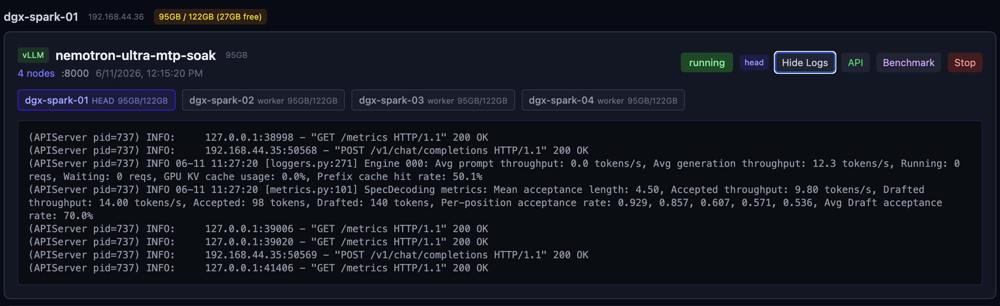

### Recipes & mods

[`recipes/dgxrun/`](recipes/dgxrun) holds the cluster's measured configurations —
GLM-5.2 (AWQ and QuantTrio Int4, DCP2/DCP4, 64K to 320K), GLM-5.3-Flash,
Qwen3.8-27B (BF16 and NVFP4, Spark and RTX 5090), DeepSeek V4 Flash, and Muse
Glimmer 30B. Each recipe carries the reasoning for its numbers in comments: why
this `gpu_memory_utilization`, what OOM'd at the next setting up, what the real
limiter turned out to be. Editing one needs no rebuild — the directory is
bind-mounted; `POST /api/recipes/refresh` re-reads the catalog.

A **mod** is a named change applied to a runtime container *before* it begins
serving, giving it a behaviour its own image does not have. A recipe declares
the mods it needs by name; each lives in [`mods/`](mods) as a directory with a
`run.sh` that the agent executes inside the container immediately before the
serve command. Mods are vendored rather than referenced for the same reason
dgxrun exists: a deployment whose behaviour depends on a registry cache someone
else refreshes is not reproducible. An unrecognised mod name is a rejected
deployment, not a warning — a runtime that starts without a mod it needed looks
perfectly healthy and fails much later, somewhere unrelated.

### Inference gateway

One OpenAI-compatible URL on the manager (`http://<manager>:4000/v1`) fronting
every running deployment. A client sends a model name; the gateway routes to
whichever deployment publishes it, without the client knowing a node, a port, or
a runtime.

- `GET /v1/models` lists what the cluster publishes, assembled from what you
  deployed rather than by asking a node — so a model present on a node but never
  deployed is neither listed nor reachable.
- `POST /v1/chat/completions` and `POST /v1/embeddings` are forwarded to a
  serving deployment. When several deployments publish the same name they form a
  **pool**, and the gateway picks the member with the fewest in-flight requests,
  rotating between ties so no member starves.
- The served surface is an **allowlist**. Every path the gateway does not serve
  is refused without contacting a node, and a backend runtime's own API is never
  exposed — a name backed by Ollama and one backed by vLLM are indistinguishable
  to a client.

The Gateway page shows the base URL and every pool currently routable. This
replaces the load balancer that was removed; [ADR 0001](docs/adr/0001-inference-gateway.md)
records why a gateway is not a load balancer.

### Models & weight cache

The Models page reads the HuggingFace cache on every node: which repos are
present, how large they are, when each was last deployed. It can trigger a
re-scan and delete a cached repo to reclaim disk — useful on a cluster where a
single checkpoint runs to hundreds of gigabytes on shared storage.

### Fine-tuning

Submit LoRA fine-tune jobs directly from the dashboard: pick a training recipe,
a dataset, and hyperparameters. Training runs via DeepSpeed ZeRO-2/3, TRL+PEFT,
or Unsloth across one or multiple nodes, with live loss-curve streaming. Finished
adapters can be merged and promoted to a deployment in one click. See
[Gemma 4 fine-tuning on DGX Spark](docs/gemma4-fine-tuning-on-dgx-spark.md) for
a detailed walk-through of a real training run.

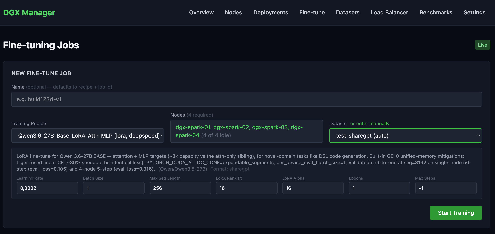

### Benchmarks & evaluation

Three kinds of run, all against a live deployment and all stored for comparison:

- **Throughput** — llama-benchy presets (`quick-smoke`, `chat-short`,
  `chat-long`, `code-32k`, `throughput`) measuring tok/s and time-to-first-token.
- **Tool eval** — tool-calling correctness.
- **Accuracy** — lm-eval-harness suites: GPQA-Diamond, MMLU-Pro, IFEval, GSM8K,
  BBH, and MATH-hard, each available as a quick sample or a full run, with
  long-generation variants for reasoning models (a 4K generation cap silently
  truncates them into wrong answers) and an answer-format-instructed variant for
  suites whose scorer needs a specific final line.

Runs execute on a **dedicated eval node** rather than on the manager, and each
run records where it ran: throughput is measured from the client, so numbers
from different hosts are not comparable and the provenance has to travel with
the result. Answer-extraction failures are surfaced explicitly — a suite that
scores zero because nothing could be extracted looks exactly like a model that
got everything wrong.

Real numbers from the cluster: [GLM-5.2 benchmark results](docs/glm-5.2-benchmark-results.md),
[GLM-5.2 from 256K to 320K](docs/glm-5.2-256k-to-320k.md),
[DeepSeek V4 Flash](docs/deepseek-v4-flash-benchmark-results.md),
[Qwen 3.6 inference benchmark](docs/qwen3.6-inference-benchmark.md).

| Benchmark runs | Compare runs side-by-side |
|---|---|
| 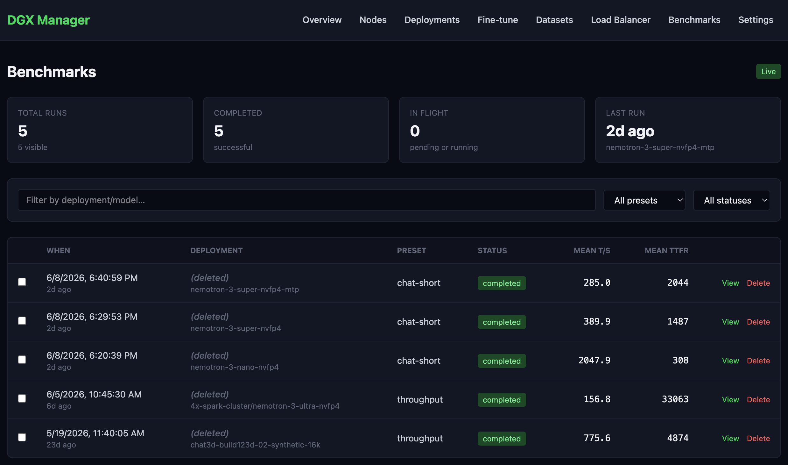 | 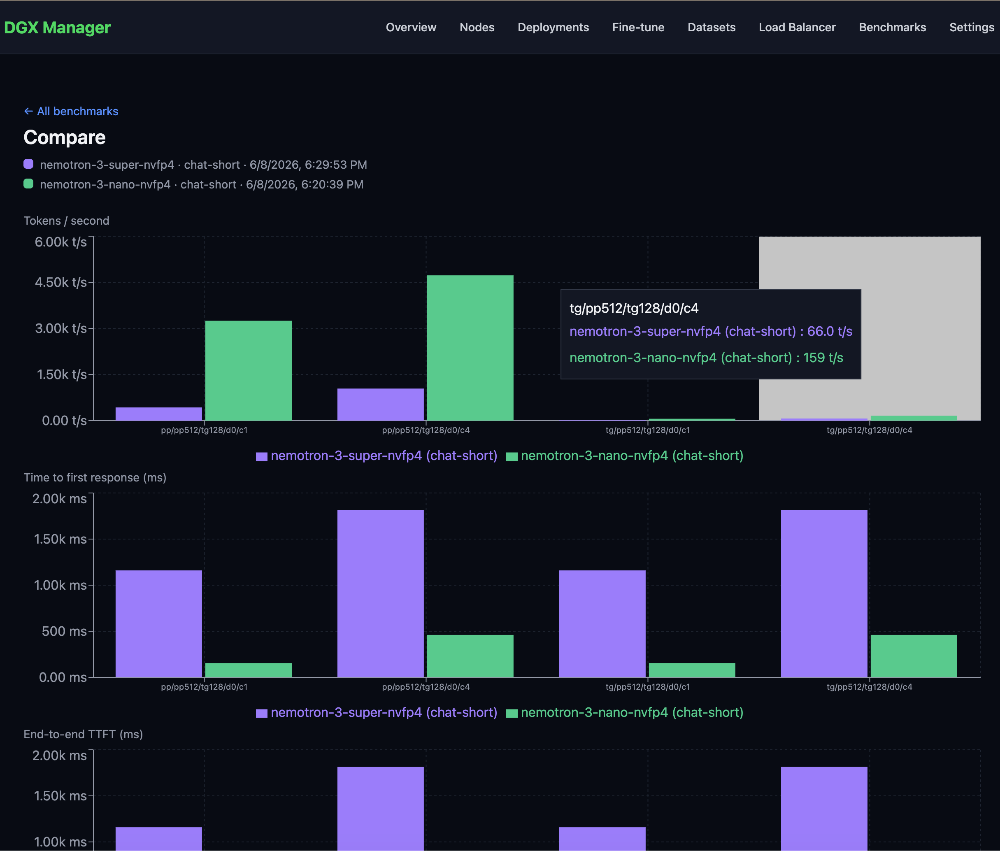 |

### Datasets

Upload training data through the dashboard, register an existing NFS path, or
point at a HuggingFace dataset ID. The format (ShareGPT, OpenAI, QA, Instruct) is
auto-detected from the first row, previewed inline, and the dataset becomes
selectable in the fine-tune job form.

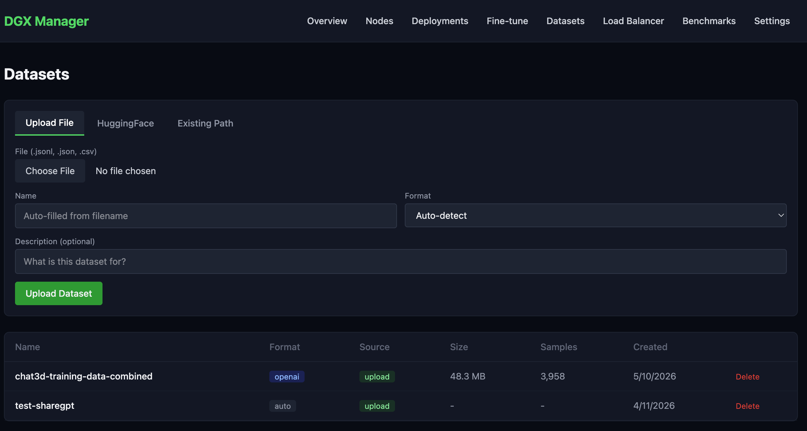

### Agent onboarding & updates

Nodes are onboarded with a single token-scoped install script that downloads the
right architecture bundle (arm64 or amd64), installs the agent as a systemd
service, and connects it back to the manager. When a new agent version ships, the
dashboard shows an upgrade prompt and the manager serves the updated bundle over
HTTP — no manual SSH needed. Full details in the
[Self-Hosting Guide](docs/SELF-HOSTING.md).

For full feature status see [docs/ROADMAP.md](docs/ROADMAP.md).

## Tech stack

TypeScript monorepo (npm workspaces) · Express 5 + `ws` · Next.js 15 / React 19 /
Tailwind 4 · Prisma 7 + SQLite · Docker / Docker Compose · Ray · DeepSpeed / PEFT /
TRL / Unsloth · [sparkrun](https://github.com/spark-arena/sparkrun) + dgxrun
(vLLM / SGLang / llama.cpp) · Ollama · llama-benchy · lm-eval-harness ·
OpenAPI 3 / Swagger UI

## Repository layout

- `packages/server` — Express REST API + WebSocket hubs + the `/v1` gateway (:4000)
- `packages/dashboard` — Next.js web UI (:3000)
- `packages/agent` — node agent: metrics, deployments, training, power
- `recipes/dgxrun` — versioned inference recipes served as the `@dgxrun` catalog
- `mods/` — vendored runtime mods a recipe can declare
- `prisma/` — Prisma schema and migrations · `scripts/` — build and node-prep scripts
- `docs/` — guides, benchmark write-ups, ROADMAP, [ADRs](docs/adr)
- `CONTEXT.md` — the domain glossary; if it disagrees with the code, one of them is wrong

**Related repositories:**
[sparkrun](https://github.com/spark-arena/sparkrun) (deploy backend) ·
[spark-arena/recipe-registry](https://github.com/spark-arena/recipe-registry) (inference recipes) ·
[dgx-manager-fine-tune-recipes](https://github.com/kreuzhofer/dgx-manager-fine-tune-recipes) (training recipes)

## API

REST under `/api`, the inference gateway under `/v1`, plus WebSocket hubs at
`/ws/dashboard` and `/ws/agent`.

| Route group | Purpose |
|-------------|---------|
| `/v1` | **Inference gateway** (OpenAI-compatible): `/models`, `/chat/completions`, `/embeddings` |
| `/api/gateway` | What the cluster publishes: base URL + routable pools |
| `/api/nodes` | Node lifecycle, provisioning, agent updates, power/wake |
| `/api/models` | Model registry |
| `/api/deployments` | Solo & cluster deployments (registry recipe, NFS path, inline `recipeYaml`, `@dgxrun` catalog), logs, restart |
| `/api/finetune` | Fine-tune jobs, resume, merge, deploy |
| `/api/recipes` | Inference recipe catalog (sparkrun registries via agents + the `@dgxrun` catalog) |
| `/api/registries` | sparkrun registries, pushed to every online node |
| `/api/training-recipes` | Training recipes + inference variants |
| `/api/hf-cache` | HuggingFace weight cache: list, scan, delete |
| `/api/cluster` | Reseed the cross-node SSH known_hosts trust mesh |
| `/api/tokens` | Single-use agent join tokens |
| `/api/settings` | Server settings |
| `/api/ollama-catalog` | Ollama model catalog |
| `/api/agent` | Agent bundle + install script |
| `/api/datasets` | Dataset upload/registration/preview |
| `/api/benchmarks` | Benchmark runs (throughput, tool-eval, accuracy) |
| `/api/openapi.json` | Machine-readable OpenAPI 3 spec for the whole API |
| `/api/docs` | Swagger UI (interactive API explorer) |
| `/api/events` | Server-Sent Events stream for real-time dashboard updates |
| `/api/health` | Health check |

Full setup and endpoint detail: **[Self-Hosting Guide](docs/SELF-HOSTING.md)**.

## Project status

Nodes and metrics, node power control, deployments (solo and multi-node, via
sparkrun and dgxrun), the inference gateway, fine-tuning, datasets, weight-cache
management, and benchmarks are functional end-to-end.

Known gaps: **staging weights** is designed but not built — deploying a model
nobody has downloaded still fails with a raw `LocalEntryNotFoundError` rather
than an explicit "not staged yet" ([ADR 0002](docs/adr/0002-staging-weights.md));
the Models page reads the weight cache but there is no model-registry browser;
and auth and multi-cluster support are future phases. See
[docs/ROADMAP.md](docs/ROADMAP.md) for the full feature status.
