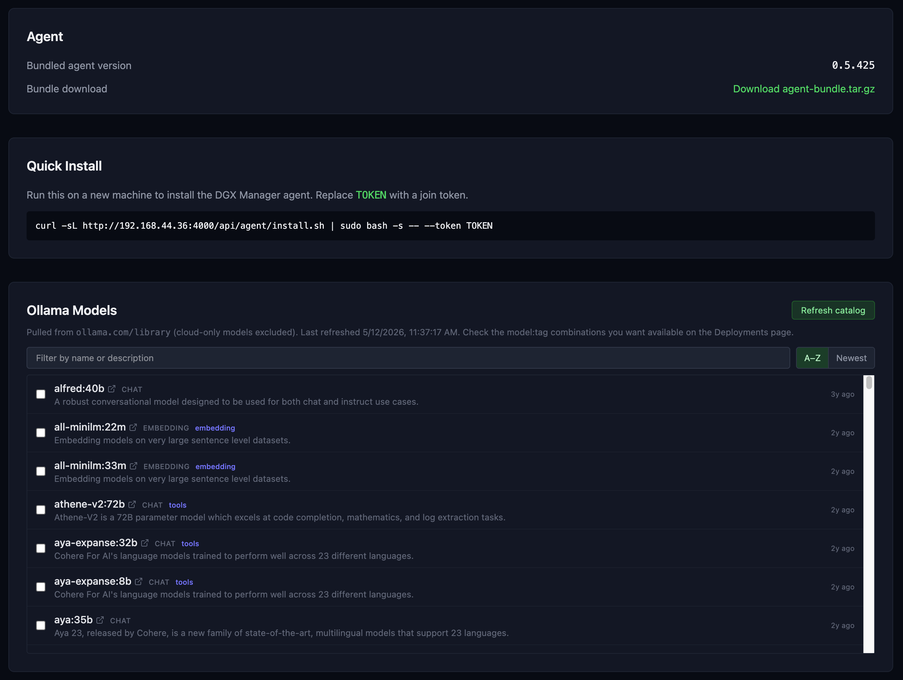

# Self-Hosting Guide

How to run DGX Manager on your own GPU cluster: stand up the manager with Docker
Compose, then onboard nodes over SSH or with a join token.

> New here? Start with the [README](../README.md) for what the system does.

---

## 1. Prerequisites

**Manager host:**

- Docker + Docker Compose (v2)
- A shared NFS mount accessible to nodes (default `/mnt/tank`) — used for model weights, recipe repos, and fine-tune outputs
- QEMU binfmt handlers (one-time setup, for cross-arch agent bundle builds)
- Node.js 22+ — only required for local development without Docker

**Nodes:**

- NVIDIA GPU with drivers installed (`nvidia-smi` must work before onboarding)
- Docker — installed automatically by the join-token installer if missing
- SSH access from the manager — required for full SSH provisioning; not required for token-based onboarding

---

## 2. Running the manager (Docker Compose — canonical)

Docker Compose is the supported way to run DGX Manager. Set `MANAGER_ADVERTISE_HOST`
to the IP address that your nodes will use to reach the manager.

```bash
# One-time host setup: register QEMU binfmt handlers for cross-arch agent builds
docker run --privileged --rm tonistiigi/binfmt --install all

# Build per-arch agent bundles (amd64 + arm64) before every compose build
./scripts/build-agent-bundles.sh

# Start (set your machine's IP and SSH user)
MANAGER_ADVERTISE_HOST=192.168.44.36 SSH_USER=daniel docker compose up -d

# Rebuild after code changes (non-disruptive — won't kill active deployments)
./scripts/build-agent-bundles.sh && \
  MANAGER_ADVERTISE_HOST=192.168.44.36 SSH_USER=daniel docker compose up -d --build

# Logs
docker compose logs server -f
docker compose logs dashboard -f
```

- Server listens on port **4000**, dashboard on port **3000**
- The full REST API is self-documenting: machine-readable spec at `GET /api/openapi.json`, interactive Swagger UI at `GET /api/docs`
- SQLite database persists in the `dgx-data` Docker volume
- Host `~/.ssh` is mounted read-only for SSH-based node management
- `NEXT_PUBLIC_*` variables are baked into the dashboard image at build time
- The shared-storage path (`SHARED_STORAGE_PATH`, default `/mnt/tank`) is bind-mounted into the server container, so it must exist and be mounted on the manager host before `docker compose up` — otherwise the server can't read recipes, datasets, or training outputs.

---

## 3. Onboarding nodes

There are three provisioning tiers, in decreasing order of automation:

### (a) Full SSH + NFS provisioning

Add a node via the dashboard or `POST /api/nodes` with an SSH address. The server
audits prerequisites, then auto-installs Docker, nvidia-container-toolkit, Node.js,
Ollama, and sets up **sparkrun** (via `uvx`, plus its non-interactive `setup ssh` /
`earlyoom` / `docker-group` steps so cluster deploys work). It deploys the agent as a
systemd service (`dgx-agent`) and registers the node. Requires SSH access and ideally
the NFS share already mounted on the node.

### (b) SSH provisioning only

Same as above but without NFS. The agent runs from `/opt/dgx-agent` using local
storage. Model weights and recipe repos must be available locally or mounted
separately.

### (c) Token-based install (no SSH required)

Generate a single-use join token from the Settings page or the API, then run the
self-contained installer on the node. The installer handles all dependencies and
registers the node automatically.

```bash
# 1. Create a single-use join token (via API or the Settings page)
curl -s -X POST -H 'Content-Type: application/json' http://<manager>:4000/api/tokens

# 2. On the node, run the self-contained installer with the token
curl -fsSL "http://<manager>:4000/api/agent/install.sh" | sudo bash -s -- --token <TOKEN>
```

The installer installs Docker, nvidia-container-toolkit, Node.js 22.x (skipped if Node ≥20 is already present), Ollama, and `uv`/`uvx` (used to run sparkrun and for first-time HuggingFace model downloads);
detects the node architecture (`uname -m`); downloads the matching agent bundle
(`/api/agent/bundle?arch=<arch>`); and registers a systemd service. The node
appears in the dashboard once the agent connects and completes registration.

The Settings page manages join tokens and shows the current agent bundle version
and one-click install command:



---

## 4. HTTP agent updates

After rebuilding agent bundles, trigger an in-place update over HTTP — no SSH needed:

```
POST /api/nodes/:id/update-agent
```

The agent downloads the new bundle, swaps files, and restarts its own systemd service.
The dashboard surfaces a version-mismatch badge and an **Upgrade** button when the
running agent version is older than the bundled version.

---

## 5. Heterogeneous hardware

Agent bundles are built per architecture by `scripts/build-agent-bundles.sh`, which
produces `agent-bundle-amd64.tar.gz` and `agent-bundle-arm64.tar.gz` under
`packages/server/agent-bundles/`. The server serves the right one at
`GET /api/agent/bundle?arch=amd64|arm64`.

The token installer auto-detects architecture via `uname -m`. The dashboard shows
an arch badge per node (sourced from `Node.arch`).

---

## 6. Local development (no Docker)

**Dev mode only — not for production or cluster use.**

```bash
npm install
cp .env.example .env
npm run db:generate && npm run db:push
npm run dev          # server (:4000) + dashboard (:3000)
npm test             # vitest suite
```

Edit `.env` to point at your server if running against a real cluster. The
`NEXT_PUBLIC_*` vars must match the address the browser can reach.

---

## 7. Environment variables

| Variable | Scope | Default | Description |
|----------|-------|---------|-------------|
| `PORT` | server | `4000` | HTTP port |
| `MANAGER_HOST` | server | `0.0.0.0` | Bind address |
| `MANAGER_ADVERTISE_HOST` | server | — | IP nodes use to reach the manager (`192.168.44.36` is only the example used in the Compose commands above) |
| `DATABASE_URL` | server | `file:./prisma/dev.db` | Prisma DB URL — Docker Compose overrides to `file:/app/data/dev.db` |
| `SHARED_STORAGE_PATH` | server + agent | `/mnt/tank` | Shared NFS storage root (model weights, recipe repos, fine-tune outputs) |
| `SSH_USER` | server | `daniel` | User for SSH node provisioning (Compose fallback `daniel`; `.env.example` example `ubuntu`) |
| `HF_TOKEN` | server | — | HuggingFace token for gated models and datasets |
| `LLAMA_BENCHY_VERSION` | server | `0.3.7` | Benchmark runner version pinned to bundled bundles |
| `METRIC_RETENTION_DAYS` | server | `7` | MetricSnapshot pruning window (days) |
| `NEXT_PUBLIC_API_URL` | dashboard | `http://localhost:4000` | Dashboard → server REST API base URL (build-time arg) |
| `NEXT_PUBLIC_WS_URL` | dashboard | `ws://localhost:4000/ws/dashboard` | Dashboard → server WebSocket URL (build-time arg) |
| `NODE_ID` | agent | — | Node ID for manual / SSH onboarding (token onboarding sets this automatically) |
| `MANAGER_URL` | agent | `ws://localhost:4000/ws/agent` | Server WebSocket URL |
| `NODE_ADVERTISE_IP` | agent | — | Override the management IP reported to the server |

The inference deploy backend is [sparkrun](https://github.com/spark-arena/sparkrun)
(pinned `sparkrun==0.2.38`), invoked by the agent via `uvx` — there is no recipe-repo
path to configure. The recipe catalog comes from sparkrun's configured registries
(see §8).

---

## 8. Recipes, registries, and engine isolation

Inference is deployed through [sparkrun](https://github.com/spark-arena/sparkrun):
the head-node agent runs `sparkrun run`, which resolves the recipe, distributes the
container image + model across the target hosts, and starts the runtime.

**Recipe catalog.** The dropdown is populated from `sparkrun list`, which enumerates
recipes from sparkrun's configured registries (e.g. `@official`,
`@sparkrun-transitional`). To add more recipes (community or your own fork), register
the git registry on the nodes:

```
sparkrun registry add <git-url>     # then they appear in `sparkrun list`
```

After adding or updating registries/recipes, refresh the catalog:

```
POST /api/recipes/refresh           # tells agents to re-run `sparkrun list`
```

**Three ways to deploy a recipe** (`POST /api/deployments`, exactly one of):

- `recipeFile` — a registry recipe ref from the catalog (e.g. `@official/<id>`).
- `recipePath` — a path to a recipe YAML staged under `SHARED_STORAGE_PATH`.
- `recipeYaml` — an **inline recipe body** posted directly in the request. The agent
  writes it to a transient file and runs it; nothing lands on the cluster filesystem.
  Ideal for a remote machine iterating on new recipes. (Validated: ≤512 KB, must look
  like a recipe; the `command:` it declares runs in a container, so treat it as a
  privileged endpoint.)

**Engine isolation.** Each recipe declares its own `runtime` (vLLM / SGLang /
llama.cpp) and `container` image, so different models can run different engine
versions side by side without affecting each other. sparkrun's default DGX Spark
image is eugr-based (`dgx-vllm-eugr-nightly`); the **first** deploy of a new image
family does a one-time from-source build (~15 min) and is cached thereafter — so the
first launch of a given recipe family is slow even though the workload is small.

**Live logs.** vLLM's detailed model-loading output streams to the deployment log via
a `sparkrun logs` follower the agent attaches after launch.

---

## 9. Troubleshooting

**Node shows wrong management IP / SSH connection refused**

The agent reports whatever IP it sees on its primary interface. If the manager is
trying to SSH to the wrong address, set `NODE_ADVERTISE_IP` in the agent's systemd
environment:

```
# /etc/systemd/system/dgx-agent.service.d/override.conf
[Service]
Environment=NODE_ADVERTISE_IP=192.168.x.y
```

Then `systemctl daemon-reload && systemctl restart dgx-agent`.

**Deployment shows "running" but model isn't serving**

The `running` status reflects that the container started, not that the model is
loaded. Large models (especially FP4 quantized or MoE) can take several minutes
after the container is up. Poll `GET /v1/models` on the deployment endpoint directly
to confirm the model is ready. Do not rely on the status field alone for readiness
checks.

**Out-of-memory / OOM kills on DGX Spark unified memory**

DGX Spark uses unified CPU+GPU memory. The effective VRAM headroom is smaller than
the headline figure once the OS, agent, and other processes are accounted for. Avoid
setting `gpu_memory_utilization` close to 1.0 or raising `max_num_batched_tokens`
aggressively — start conservative and increase with evidence. If a deployment OOMs
on launch, reduce `gpu_memory_utilization` in the recipe by 0.05–0.10 increments.
