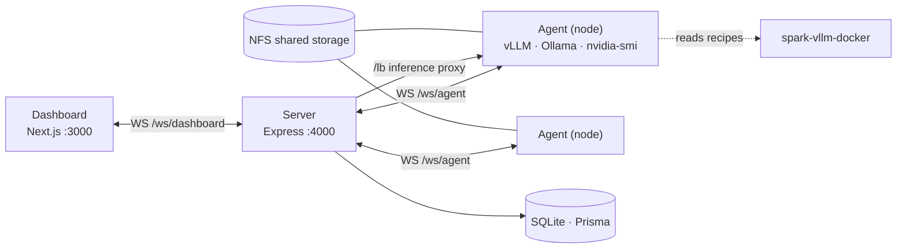
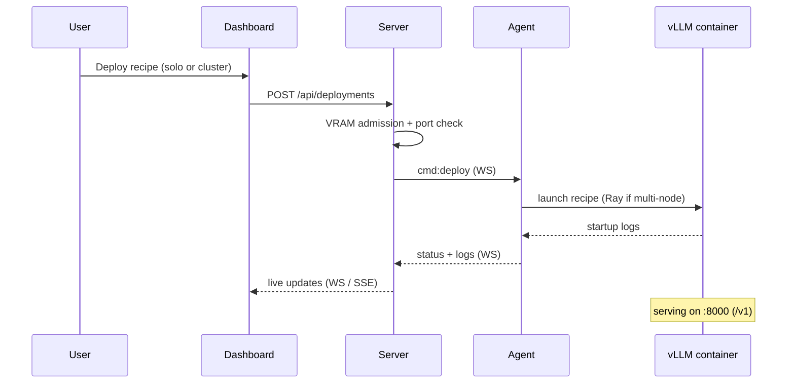

# README + Documentation Refresh — Implementation Plan

> **For agentic workers:** REQUIRED SUB-SKILL: Use superpowers:subagent-driven-development (recommended) or superpowers:executing-plans to implement this plan task-by-task. Steps use checkbox (`- [ ]`) syntax for tracking.

**Goal:** Rewrite `README.md` as an accurate capability showcase, move all operator/setup content into a new `docs/SELF-HOSTING.md`, and bring `docs/ROADMAP.md` current — so a new GitHub visitor grasps the full system in under a minute.

**Architecture:** Three doc artifacts, no code changes. README = showcase + architecture (Mermaid) + feature tour + reference, with a self-hosting link at the very top and screenshot placeholders pointing at `docs/screenshots/`. SELF-HOSTING.md = the corrected, Docker-Compose-canonical operator guide. ROADMAP = factual catch-up keeping its existing structure.

**Tech Stack:** Markdown, GitHub-flavored Mermaid. Source of truth: `docs/superpowers/specs/2026-06-11-docs-refresh-design.md`.

---

## Accuracy constraints (apply to EVERY task)

These were verified against the codebase on 2026-06-11. Do not contradict them:

- **Models** and **Load Balancer** dashboard pages are **stubs** (placeholder text). The load-balancer *server API + inference proxy* are complete; the **UI is pending**. Never claim a Models or Load Balancer UI exists.
- **Benchmarks** (`/benchmarks`, `/benchmarks/compare`, `/benchmarks/[id]`) and **Datasets** pages are **real and shipped**.
- Benchmark presets: `quick-smoke`, `chat-short`, `chat-long`, `code-32k`, `throughput` (llama-benchy runner).
- **Docker Compose is the canonical run path.** `npm run dev` is local-development only — never present it as the way to run the agent in production.
- 13 server route groups are mounted under `/api` (see Task 2, API table).
- Deployment `status: "running"` means the container started, **not** that vLLM is serving — large models keep loading after that. Mention this honestly where relevant.

## File structure

- **Create:** `docs/SELF-HOSTING.md` — operator guide (all setup content).
- **Modify (full rewrite):** `README.md` — capability showcase + reference.
- **Modify (factual catch-up):** `docs/ROADMAP.md`.
- Already committed (do not recreate): `missing-screenshots.md`, the spec under `docs/superpowers/specs/`.
- Images at `docs/screenshots/` are supplied by the user later; this plan only writes the placeholder links.

Build order: SELF-HOSTING.md first (README links to it), then README, then ROADMAP, then a final verification pass.

---

## Task 1: Create `docs/SELF-HOSTING.md`

**Files:**
- Create: `docs/SELF-HOSTING.md`

- [ ] **Step 1: Gather the exact, current facts to embed**

Read these so every command/path is accurate (do not guess):
```bash
sed -n '1,80p' CLAUDE.md                                  # canonical Docker Compose commands
grep -nE "agentBundleRouter|install.sh|/bundle|/version" packages/server/src/routes/agent-bundle.ts
grep -nE "environment:|MANAGER_ADVERTISE_HOST|SSH_USER|SHARED_STORAGE_PATH|LLAMA_BENCHY_VERSION|HF_TOKEN" docker-compose.yml
grep -rnE "process.env.(METRIC_RETENTION_DAYS|NODE_ADVERTISE_IP|VLLM_REPO_PATH)" packages/server packages/agent | head
```
Expected: confirms the Compose invocation, the agent-bundle/install routes, and the env-var names used below.

- [ ] **Step 2: Write `docs/SELF-HOSTING.md`**

Write the file with the following sections. Use the verbatim command blocks shown; write surrounding prose yourself, concise and operator-focused.

Title + intro:
```markdown
# Self-Hosting Guide

How to run DGX Manager on your own GPU cluster: stand up the manager with Docker
Compose, then onboard nodes over SSH or with a join token.

> New here? Start with the [README](../README.md) for what the system does.
```

**1. Prerequisites** — Host: Docker + Docker Compose; a shared NFS mount (default `/mnt/tank`); QEMU binfmt for cross-arch agent bundles; Node.js 22+ for local dev only. Nodes: NVIDIA GPU with `nvidia-smi`, Docker; SSH access (full provisioning) or just network reachability (token onboarding).

**2. Running the manager (Docker Compose — canonical)** — embed verbatim:
````markdown
```bash
# One-time host setup: register QEMU binfmt handlers for cross-arch agent builds
docker run --privileged --rm tonistiigi/binfmt --install all

# Build per-arch agent bundles (amd64 + arm64) before every compose build
./scripts/build-agent-bundles.sh

# Start (set your machine's IP and SSH user)
MANAGER_ADVERTISE_HOST=192.168.44.36 SSH_USER=daniel docker compose up -d

# Rebuild after code changes (non-disruptive — won't kill active deployments)
./scripts/build-agent-bundles.sh && \
  MANAGER_ADVERTISE_HOST=192.168.44.36 SSH_USER=daniel docker compose up -d --build

# Logs
docker compose logs server -f
docker compose logs dashboard -f
```
````
Note: server :4000, dashboard :3000; SQLite persists in the `dgx-data` volume; host `~/.ssh` is mounted read-only for node management.

**3. Onboarding nodes** — the three tiers: (a) full SSH + NFS provisioning (audit prereqs, auto-install Docker / nvidia-container-toolkit / Node.js / Ollama, deploy agent as a systemd service); (b) SSH only; (c) join-token install script. For (c) embed:
````markdown
```bash
# 1. Create a single-use join token (via API or the Settings page)
curl -s -X POST http://<manager>:4000/api/tokens

# 2. On the node, run the self-contained installer (token from step 1)
curl -fsSL "http://<manager>:4000/api/agent/install.sh?token=<TOKEN>" | sudo bash
```
````
The installer provisions Docker, nvidia-container-toolkit, Node.js, Ollama, downloads the arch-matched agent bundle, and registers a systemd service. (Verify the exact install-script route/query param against `packages/server/src/routes/agent-bundle.ts` from Step 1 and correct if needed.)

**4. HTTP agent updates** — rebuild bundles, then `POST /api/nodes/:id/update-agent`; the agent downloads the new bundle, swaps files, restarts. The dashboard surfaces a version mismatch / upgrade prompt.

**5. Heterogeneous hardware** — per-arch bundles (`agent-bundle-{amd64,arm64}.tar.gz`) via `scripts/build-agent-bundles.sh`; `Node.arch` tracked and shown as a badge; installer detects `uname -m`.

**6. Local development (no Docker)** — embed verbatim, label clearly as dev-only:
````markdown
```bash
npm install
cp .env.example .env
npm run db:generate && npm run db:push
npm run dev          # server (:4000) + dashboard (:3000)
npm test             # vitest suite
```
````

**7. Environment variables** — full table:
````markdown
| Variable | Scope | Default | Description |
|----------|-------|---------|-------------|
| `PORT` | server | `4000` | HTTP port |
| `MANAGER_HOST` | server | `0.0.0.0` | Bind address |
| `MANAGER_ADVERTISE_HOST` | server | — | IP nodes use to reach the manager |
| `DATABASE_URL` | server | `file:./dev.db` | Prisma DB URL |
| `SHARED_STORAGE_PATH` | server/agent | `/mnt/tank` | Shared storage root |
| `SSH_USER` | server | — | User for SSH node provisioning |
| `HF_TOKEN` | server | — | HuggingFace token (gated models/datasets) |
| `LLAMA_BENCHY_VERSION` | server | `0.3.7` | Benchmark runner version |
| `METRIC_RETENTION_DAYS` | server | `7` | MetricSnapshot pruning window |
| `NEXT_PUBLIC_API_URL` | dashboard | `http://localhost:4000` | Dashboard → server API (build arg) |
| `NEXT_PUBLIC_WS_URL` | dashboard | `ws://localhost:4000/ws/dashboard` | Dashboard → server WS (build arg) |
| `NODE_ID` | agent | — | Node ID (SSH/manual onboarding) |
| `MANAGER_URL` | agent | `ws://localhost:4000/ws/agent` | Server WS URL |
| `NODE_ADVERTISE_IP` | agent | — | Override node management IP |
| `VLLM_REPO_PATH` | agent | `/mnt/tank/src/github/spark-vllm-docker` | Recipe repo path |
````
(Confirm defaults against Step 1 output; fix any that differ.)

**8. vLLM recipes & engine isolation** — agent clones/reads spark-vllm-docker at `VLLM_REPO_PATH`; recipes are YAML (model, container image, quantization, defaults); `POST /api/recipes/refresh` re-scans; different recipes can pin different container images (engine isolation), e.g. an isolated image for newer vLLM.

**9. Troubleshooting** — at least: management-IP mismatch → set `NODE_ADVERTISE_IP`; "running ≠ serving" for big models (poll `/v1/models`, not the status field); thin unified-memory headroom on DGX Spark (don't over-raise `max_num_batched_tokens` / `gpu_memory_utilization`).

- [ ] **Step 3: Verify the file is internally consistent**

Run:
```bash
test -f docs/SELF-HOSTING.md && echo "exists"
grep -c '```' docs/SELF-HOSTING.md   # even number = all fences closed
grep -n "npm run dev" docs/SELF-HOSTING.md   # must appear ONLY under "Local development"
```
Expected: file exists; backtick-fence count is even; `npm run dev` only in the dev section.

- [ ] **Step 4: Commit**

```bash
git add docs/SELF-HOSTING.md
git commit -m "docs: add self-hosting guide (Docker Compose canonical + node onboarding)

Co-Authored-By: Claude Opus 4.8 <noreply@anthropic.com>"
```

---

## Task 2: Rewrite `README.md`

**Files:**
- Modify (full rewrite): `README.md`

- [ ] **Step 1: Replace the entire README with the showcase structure below**

Top matter — title, one-liner, and the self-hosting link at the very top:
```markdown
# DGX Manager

A self-hosted control plane for a DGX Spark GPU cluster: provision nodes over
SSH or a join token, deploy and load-balance inference, fine-tune models, and
benchmark them — with a real-time web dashboard and zero cloud dependencies.

> **Running it yourself?** See the **[Self-Hosting Guide](docs/SELF-HOSTING.md)**.
```

**Capabilities at a glance** (bulleted; keep the parentheticals — they're the accuracy guardrails):
```markdown
## What it does

- **Real-time GPU telemetry** — utilization, VRAM, temperature, network/RDMA across every node at 5-second resolution
- **One-click model deployment** — vLLM (container, YAML-recipe-driven) and Ollama (native)
- **Multi-node inference clusters** — tensor/pipeline parallelism over Ray; serves models up to **Nemotron-3-Ultra 550B-A55B NVFP4 across 4 nodes**
- **Load-balanced inference proxy** — round-robin / first-available routing *(server-side; dashboard UI pending)*
- **End-to-end fine-tuning** — LoRA via DeepSpeed ZeRO-2/3, TRL+PEFT, or Unsloth; multi-node training; resume-from-checkpoint; merge → deploy in one loop
- **Live training observability** — phase-aware progress and a live loss curve (train + eval overlay) streamed to the dashboard
- **Benchmarking & evaluation** — llama-benchy presets (`quick-smoke`, `chat-short`, `chat-long`, `code-32k`, `throughput`) with a compare view
- **Zero-touch onboarding** — single-use join tokens + a self-contained install script; HTTP agent auto-update
- **Heterogeneous hardware** — arm64 (DGX Spark / GB10) and amd64 nodes, per-arch agent bundles
```

**Architecture** — embed both Mermaid diagrams verbatim:
````markdown
## Architecture

A three-package TypeScript monorepo. The dashboard talks to the server over
WebSocket; the server talks to an agent on each node; agents run the runtimes
and report metrics.



A deployment flows from the dashboard to a node and streams back live:


````

**Screenshots** — placeholders pointing at `docs/screenshots/` (heroes only here):
```markdown
## Screenshots

> Images live in [`docs/screenshots/`](docs/screenshots/) — see [`missing-screenshots.md`](missing-screenshots.md).

| Cluster overview | Multi-node deployment |
|---|---|
|  |  |

| Live training loss curve | Benchmarks |
|---|---|
|  |  |
```

**Feature tour** — one tight subsection (3–5 lines) per domain, linking to deep-dives. Must include: Nodes & metrics; Deployments (solo + cluster, VRAM admission, log streaming, "running ≠ serving" caveat); Fine-tuning (link `docs/gemma4-fine-tuning-on-dgx-spark.md`); Benchmarks & eval (link `docs/qwen3.6-inference-benchmark.md`); Load balancer (**API complete, UI pending**); Agent onboarding & updates (link `docs/SELF-HOSTING.md`). Reference `docs/ROADMAP.md` for full status.

**Tech stack**: TypeScript monorepo (npm workspaces); Express 5 + `ws`; Next.js 15 / React 19 / Tailwind 4; Prisma + SQLite; Docker / Docker Compose; Ray; DeepSpeed / PEFT / TRL / Unsloth; vLLM; Ollama; llama-benchy.

**Repository layout**:
```markdown
## Repository layout

- `packages/server` — Express REST API + WebSocket hubs (:4000)
- `packages/dashboard` — Next.js web UI (:3000)
- `packages/agent` — node agent: metrics, deployments, training
- `docs/` — guides, deep-dive write-ups, ROADMAP, specs/plans
```
Plus a Related repositories note: [spark-vllm-docker](https://github.com/kreuzhofer/spark-vllm-docker), [dgx-manager-fine-tune-recipes](https://github.com/kreuzhofer/dgx-manager-fine-tune-recipes).

**API surface** — complete top-level table (these 13 mounts are exact, from `packages/server/src/index.ts`):
```markdown
## API

REST under `/api`, plus WebSocket hubs at `/ws/dashboard` and `/ws/agent`.

| Route group | Purpose |
|-------------|---------|
| `/api/nodes` | Node lifecycle, provisioning, agent updates |
| `/api/models` | Model registry |
| `/api/deployments` | Solo & cluster deployments, logs, restart |
| `/api/finetune` | Fine-tune jobs, resume, merge, deploy |
| `/api/lb` | Load-balancer rules, endpoints, proxy |
| `/api/recipes` | vLLM recipes (discovered from agents) |
| `/api/training-recipes` | Training recipes + inference variants |
| `/api/tokens` | Single-use agent join tokens |
| `/api/settings` | Server settings |
| `/api/ollama-catalog` | Ollama model catalog |
| `/api/agent` | Agent bundle + install script |
| `/api/datasets` | Dataset upload/registration/preview |
| `/api/benchmarks` | llama-benchy benchmark runs |

Full setup and endpoint detail: **[Self-Hosting Guide](docs/SELF-HOSTING.md)**.
```

**Project status** — 2-3 sentences: nodes/metrics, deployments, fine-tuning, datasets, benchmarks are functional end-to-end; Models and Load Balancer have complete server APIs with dashboard UIs still pending; auth and multi-cluster are future phases. Link `docs/ROADMAP.md`.

- [ ] **Step 2: Verify the README**

Run:
```bash
grep -c '```mermaid' README.md            # expect 2
grep -c '```' README.md                   # even (all fences closed)
grep -n "npm run dev\|Running the Agent" README.md   # expect NO matches (setup moved out)
grep -n "SELF-HOSTING.md" README.md       # expect >=2 (top link + API/status)
for f in docs/SELF-HOSTING.md docs/ROADMAP.md docs/gemma4-fine-tuning-on-dgx-spark.md docs/qwen3.6-inference-benchmark.md missing-screenshots.md; do test -f "$f" && echo "OK $f" || echo "MISSING $f"; done
```
Expected: 2 mermaid blocks; even fence count; **zero** `npm run dev` / "Running the Agent" hits; ≥2 self-hosting links; all linked files exist.

- [ ] **Step 3: Commit**

```bash
git add README.md
git commit -m "docs: rewrite README as capability showcase

Move setup to docs/SELF-HOSTING.md (linked at top), add Mermaid architecture +
deploy-lifecycle diagrams, complete 13-group API table, screenshot placeholders.

Co-Authored-By: Claude Opus 4.8 <noreply@anthropic.com>"
```

---

## Task 3: Refresh `docs/ROADMAP.md`

**Files:**
- Modify: `docs/ROADMAP.md`

- [ ] **Step 1: Update Phase 5 (Evaluation & Benchmarks) — benchmarks have shipped**

Change the Phase 5 heading marker from `🔜` to `(in progress)`. Immediately under the heading, add a shipped subsection (keep all existing SQL-eval findings below it unchanged):
```markdown
### Benchmarking (shipped)

- llama-benchy benchmark runner integrated via `POST /api/benchmarks { deploymentId, presetId }`
- Presets: `quick-smoke`, `chat-short`, `chat-long`, `code-32k`, `throughput`
- Dashboard: results list, per-run detail (`/benchmarks/[id]`), and a compare view (`/benchmarks/compare`)
- Per-concurrency throughput + TTFR captured to `result.json` and the DB
```

- [ ] **Step 2: Update the Status Matrix**

In the matrix, set the `Evaluation` row's Dashboard cell to reflect the benchmark UI (e.g. `✅ (benchmarks) / partial (eval)`), and add a row if missing:
```markdown
| Benchmarks | ✅ | — | ✅ | ✅ |
```
Leave `Models` and `Load Balancer` Dashboard cells as `placeholder` (verified still stubs). Do not change other rows.

- [ ] **Step 3: Add a "Recent work (May–June 2026)" subsection**

Add near the top of the Status Matrix section (or just above it):
```markdown
## Recent work (May–June 2026)

- **Nemotron-3-Ultra NVFP4 TP=4** — 550B-A55B served across 4 DGX Spark nodes (Ray, engine-isolated vLLM container); MTP speculative decoding enabled via per-MoE-type backend selection
- **Metrics retention** — MetricSnapshot pruning (`METRIC_RETENTION_DAYS`, default 7d) + `(nodeId, timestamp DESC)` index
- **Inference-variant selector** — choose an inference template per recipe on deploy/restart
- **Log catch-up** — deployment + fine-tune logs reconcile on tab-visible / SSE reconnect
- **Node management-IP override** — `NODE_ADVERTISE_IP` for correct multi-node binding
- **Verboseness eval** — thinking-mode response-length probe
```

- [ ] **Step 4: Update the "Last updated" line**

Change the trailing `*Last updated: April 14, 2026*` to `*Last updated: June 11, 2026*`.

- [ ] **Step 5: Verify**

Run:
```bash
grep -n "Last updated: June 11, 2026" docs/ROADMAP.md      # expect 1
grep -n "Benchmarking (shipped)\|Recent work (May–June 2026)" docs/ROADMAP.md   # expect both
grep -nE "Models|Load Balancer" docs/ROADMAP.md | grep -i placeholder   # LB/Models still placeholder
```
Expected: updated date present; both new subsections present; Models/LB still marked placeholder.

- [ ] **Step 6: Commit**

```bash
git add docs/ROADMAP.md
git commit -m "docs: refresh ROADMAP — benchmarks shipped + May–June work

Co-Authored-By: Claude Opus 4.8 <noreply@anthropic.com>"
```

---

## Task 4: Final verification pass

**Files:** none (read-only checks)

- [ ] **Step 1: Confirm no code was touched (test suite unaffected)**

Run:
```bash
git diff --name-only HEAD~4 HEAD | grep -vE '\.md$' || echo "docs-only — good"
npm test 2>&1 | tail -5
```
Expected: only `.md` files changed across the doc commits; `npm test` still green (sanity — nothing in code changed).

- [ ] **Step 2: Cross-check capability claims against the accuracy constraints**

Run:
```bash
grep -rniE "models (ui|dashboard|page)|load.?balancer (ui|dashboard|page)" README.md docs/SELF-HOSTING.md
```
Expected: any hit explicitly says UI is **pending/placeholder** — no claim of a finished Models/LB UI.

- [ ] **Step 3: Confirm all intra-repo doc links resolve**

Run:
```bash
grep -rhoE '\]\((docs/[^)]+|\.\./[^)]+|[A-Za-z0-9._/-]+\.md)\)' README.md docs/SELF-HOSTING.md \
 | sed -E 's/^\]\(//; s/\)$//' | sort -u \
 | while read l; do case "$l" in docs/screenshots/*) echo "SKIP (image, supplied later) $l";; *) f="$l"; [ "${l#../}" != "$l" ] && f="docs/${l#../}"; test -e "$f" && echo "OK $l" || echo "BROKEN $l";; esac; done
```
Expected: every link `OK` except `docs/screenshots/*` (SKIP — images come later). Fix any `BROKEN`.

- [ ] **Step 4: Report completion**

Summarize: three artifacts written + committed, screenshots still pending (per `missing-screenshots.md`), and remind the user the screenshot links go live once images land in `docs/screenshots/`.

---

## Self-review (completed by plan author)

- **Spec coverage:** README rewrite (Task 2) ↔ spec Artifact 1; SELF-HOSTING.md (Task 1) ↔ Artifact 2; ROADMAP (Task 3) ↔ Artifact 3; screenshot manifest already shipped as `missing-screenshots.md` and referenced in Task 2 Step 1. Accuracy constraints enforced in every task + Task 4. ✅
- **Placeholder scan:** no TBD/TODO; all embedded tables, diagrams, and command blocks are complete. Screenshot *image* links are intentional placeholders (the only "fill later" items, owned by the user). ✅
- **Consistency:** filename `docs/SELF-HOSTING.md`, folder `docs/screenshots/`, and the 13-group API table are identical across tasks. ✅
